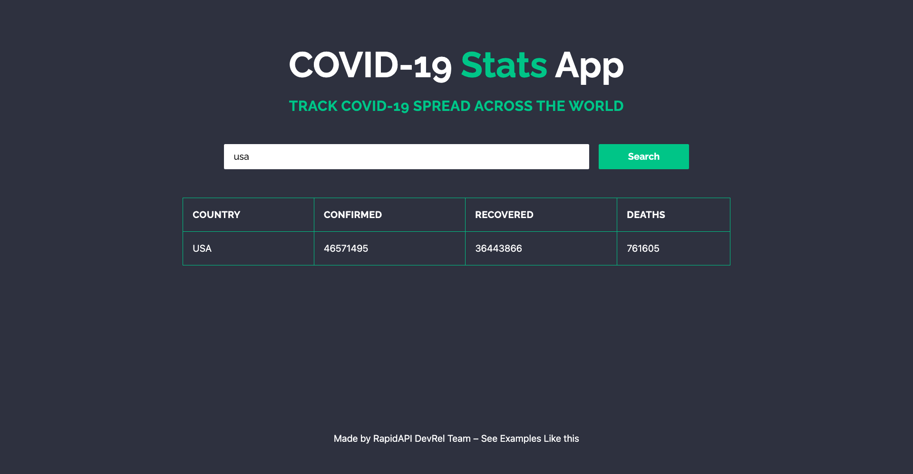

<div align="center">
	<h2>COVID Stats App</h2>
</div>

> [Live Preview](https://rapidapi-example-covid-stats.vercel.app/)

### ⚡️ Features

- Displays up-to-date stats of any country of your choice
- Mobile friendly

### 🛠️ Installation Steps

1. Clone the repository

```bash
git clone https://github.com/RapidAPI/DevRel-Examples-External.git
```

2. Change the working directory

```bash
cd DevRel-Examples-External/covid-stats-app
```

3. Install dependencies

```bash
npm install
```

4. Create `.env.local` file in root and add your variables

```bash
NEXT_PUBLIC_RAPIDAPI_KEY=YOUR_RAPID_API_KEY
```

5. Run the app

```bash
npm run dev
```

You are all set! Open [localhost:3000](http://localhost:3000/) to see the app.
