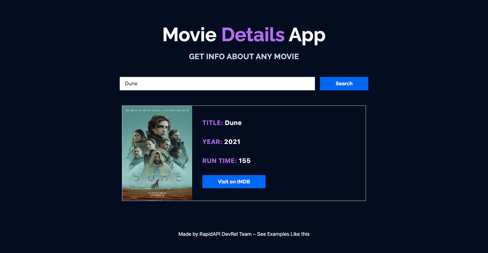

<div align="center">
	<h2>Movie Details App</h2>
</div>

> [Live Preview](https://rapidapi-example-movie-details-app.vercel.app/)

### ⚡️ Features

- Display movie poster, name, year of release, and run time.
- Links to the movie IMDB page
- Mobile friendly

### 🛠️ Installation Steps

1. Clone the repository

```bash
git clone https://github.com/RapidAPI/DevRel-Examples-External.git
```

2. Change the working directory

```bash
cd DevRel-Examples-External/movie-details-app
```

3. Install dependencies

```bash
npm install
```

4. Create `.env.local` file in root and add your variables

```bash
NEXT_PUBLIC_RAPIDAPI_KEY=YOUR_RAPID_API_KEY
```

5. Run the app

```bash
npm run dev
```

You are all set! Open [localhost:3000](http://localhost:3000/) to see the app.
