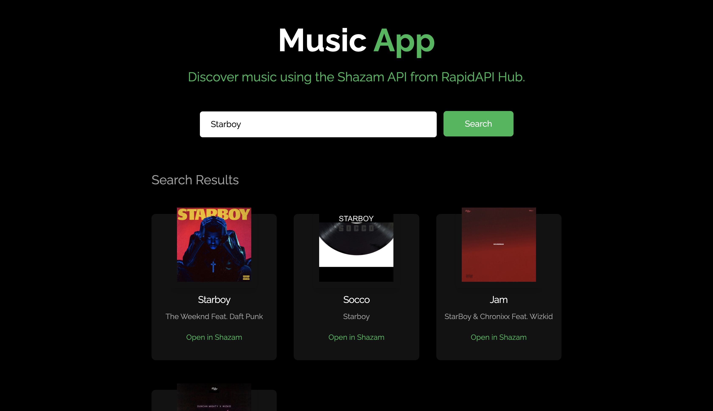

<div align="center">
	<h2>Music App</h2>
</div>

> [Live Preview](https://rapidapi-example-music-app.vercel.app/)

## Guide

[Read a step-by-step guide to build this application.](https://rapidapi.com/guides/build-music-app)

### ⚡️ Features

- Discover music using Shazam API from RapidAPI Hub.

### 🛠️ Installation Steps

1. Clone the repository

```bash
git clone https://github.com/RapidAPI/DevRel-Examples-External.git
```

2. Change the working directory

```bash
cd DevRel-Examples-External/music-app
```

3. Install dependencies

```bash
npm install
```

4. Create `.env.local` file in root and add your RapidAPI key.

```bash
NEXT_PUBLIC_RAPIDAPI_KEY=YOUR_RAPID_API_KEY
```

5. Run the app

```bash
npm run dev
```

You are all set! Open [localhost:3000](http://localhost:3000/) to see the app.
