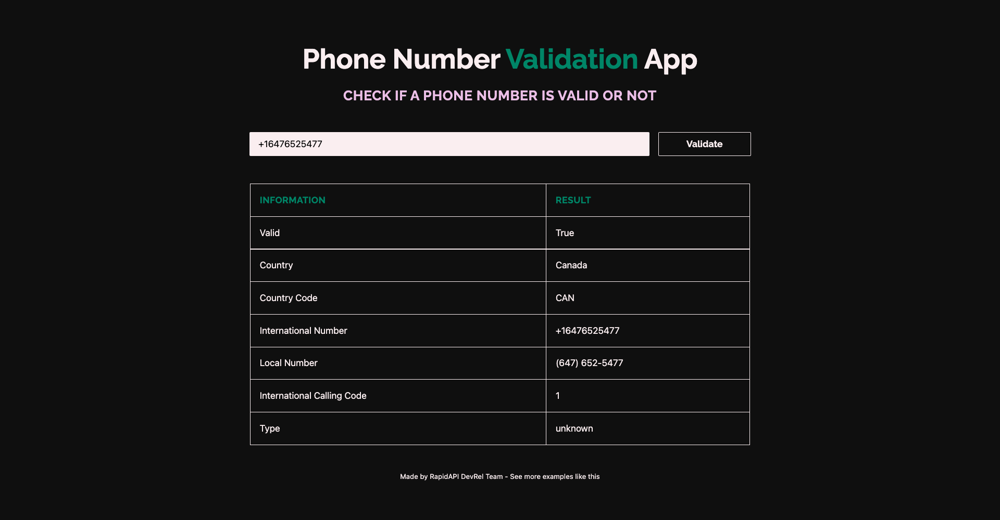

<div align="center">
	<h2>Phone Number Validation App</h2>
</div>

> [Live Preview](https://rapidapi-example-phone-number-validation-app.vercel.app/)

### ⚡️ Features

- Checks if a number is valid or not
- Provide other information related to phone number
- Mobile Friendly

## 📖 Guide

[*Read how we build this application*](https://rapidapi.com/guides/build-phone-number-validation-app)

### 🛠️ Installation Steps

1. Download the `phone-number-validate-app` directory. Click [here](https://download-directory.github.io/?url=https://github.com/RapidAPI/DevRel-Examples-External/tree/main/phone-number-validate-app) to download it.

2. Unzip the downloaded file and navigate to the working directory.

```bash
cd RapidAPI\ DevRel-Examples-External\ main\ phone-number-validate-app/
```


3. Install dependencies

```bash
npm install
```

4. Create `.env.local` file in root and add your RapidAPI key.

```bash
NEXT_PUBLIC_RAPIDAPI_KEY=YOUR_RAPID_API_KEY
```

5. Run the app

```bash
npm run dev
```

You are all set! Open [localhost:3000](http://localhost:3000/) to see the app.
