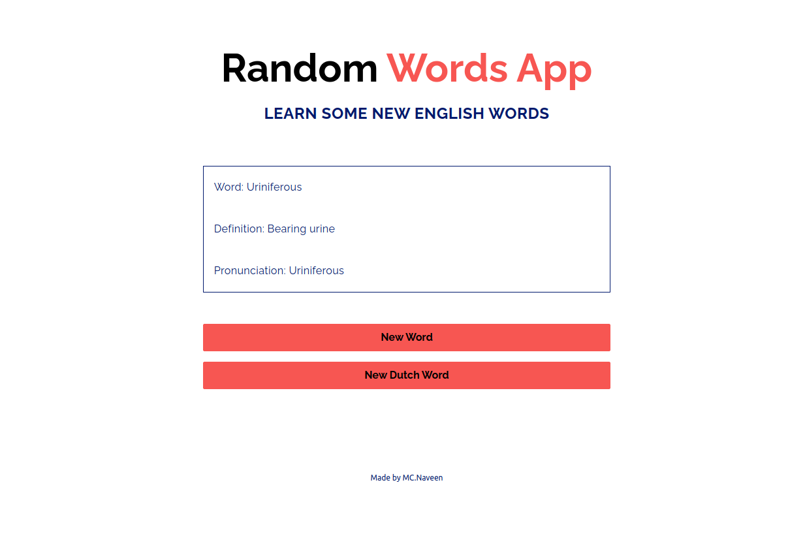

<div align="center">
	<h2>Random Words App</h2>
</div>

> [Live Preview](https://rapidapi-example-random-words-app.vercel.app/)

### ⚡️ Features

- Show different words in different languages (English, Dutch)
- Mobile Friendly


### 🛠️ Installation Steps

1. Download the `random-words-app` directory. Click [here](https://download-directory.github.io/?url=https://github.com/RapidAPI/DevRel-Examples-External/tree/main/random-words-app) to download it.

2. Unzip the downloaded file and navigate to the working directory.

```bash
cd RapidAPI\ DevRel-Examples-External\ main\ random-words-app/
```

3. Install dependencies

```bash
npm install
```

4. Copy `.env.example` file in root.

```
cp .env.example .env
```

5. Now edit the ENV file and add your RapidAPI key.


```bash
NEXT_PUBLIC_RAPIDAPI_KEY=YOUR_RAPID_API_KEY
```

6. Run the app

```bash
npm run dev
```

You are all set! Open [localhost:3000](http://localhost:3000/) to see the app.
