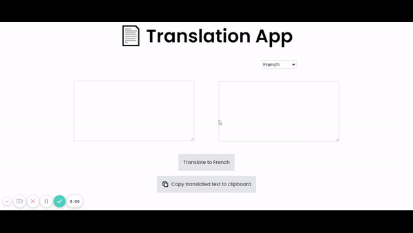

# Translation App

Translate text from English to French/Spanish/Russian/Hindi/Bengali/Arabic/Marathi/Italian/Dutch/Portuguese!



> [Live Preview](https://rapidapi-example-translation-app.vercel.app/)

## ⚡️ Features

- Translate text from English to French/Spanish/Russian/Hindi/Bengali/Arabic/Marathi/Italian/Dutch/ Portuguese
- Neat UI
- Option to copy translated text

## 🛠️ Installation Steps

1. Clone the repository

```bash
git clone https://github.com/RapidAPI/DevRel-Examples-External.git
```

2. Change the working directory

```bash
cd DevRel-Examples-External/translation-app
```

3. Install dependencies

```bash
npm install
```

4. Create `.env.local` file in root and add your variables

```bash
NEXT_PUBLIC_GOOGLE_TRANSLATE_API_KEY=YOUR_RAPID_API_KEY
```

5. Run the app

```bash
npm run dev
```

You are all set! Open [localhost:3000](http://localhost:3000/) to see the app.

## 👨‍💻 Author

### 🧍 Prashoon Bhattacharjee

- Website: https://prashoonb.tech
- Twitter: [@prashoonb](https://twitter.com/prashoonb)
- Github: [@Prashoon123](https://github.com/Prashoon123)
- LinkedIn: [@prashoon-bhattacharjee](https://www.linkedin.com/in/prashoon-bhattacharjee/
